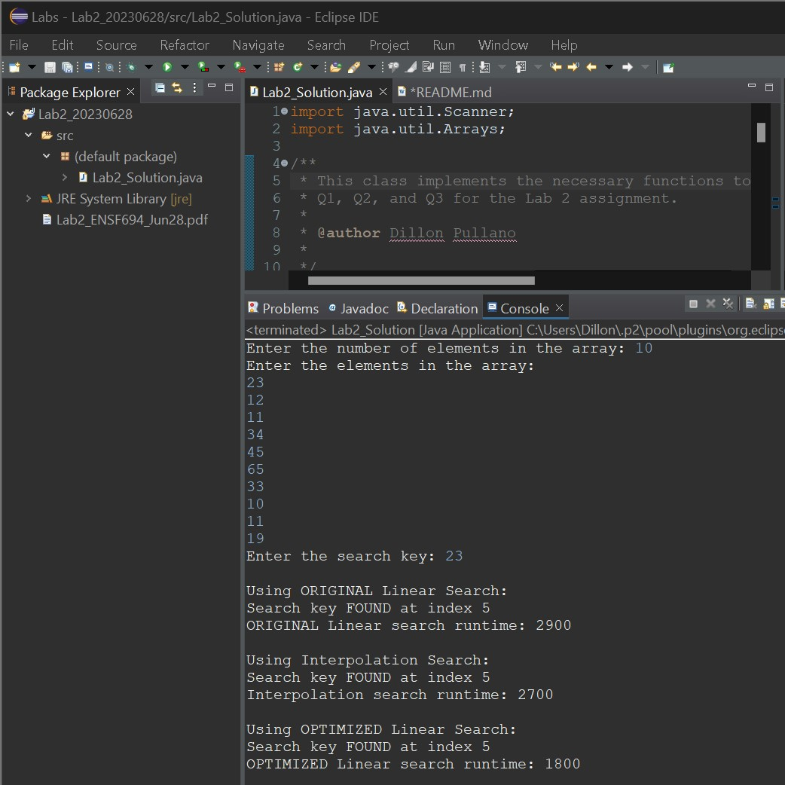

# Lab2_20230628
 Submission files for ENSF 694 - Lab # 2
 
 Please download the Github repository submitted through D2L to get all submitted files.
 
# Author:
DILLON PULLANO

# Question 1 (Sample Output):

# Question 2:
For the example shown in the added screenshot:
   - Linear search took 2900 nanoseconds
   - Interpolation search took 2700 nanoseconds
   
Interpolation was a little faster than linear. However, this difference increases when a non-sorted array is used with the linear method.

It makes sense that interpolated should be faster since it takes a weighted approximated guess to reach a result instead of just linearly progressing through the data.

# Question 3:
My improved version of the linear search algorithm makes the assumption that the array is first sorted. 
   - Firstly, the algorithm checks the search key against the middle index value, similar to binary search. 
   - If the search key is lower than the middle index, a linear search is done in the negative direction from the middle index to the start of the array.
   - If the search key is higher than the middle index, a linear search is done in the positive direction from the middle index to the end of the array.
   
Using the sample output shown in the added screenshot, this change brought the runtime down from 2900 nanoseconds to 1800 nanoseconds. 
   - Runtime cut down to approximately 62% of original by making this improvement
   - This is an improvement of approximately 38%